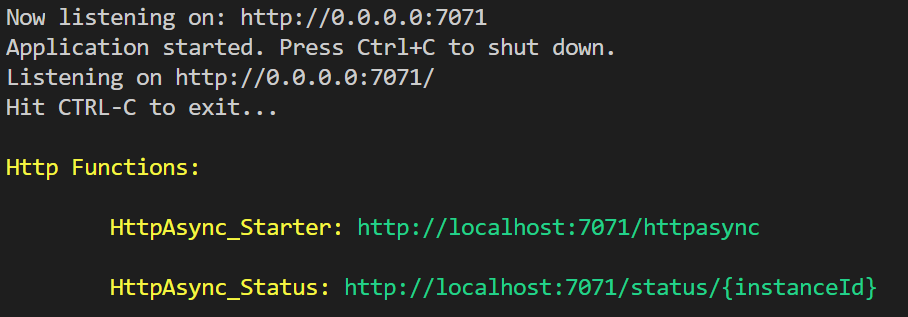
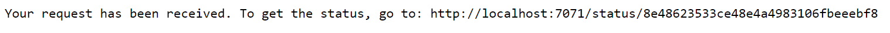
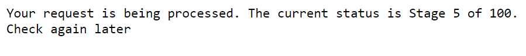

# Async Http Sample

## Initialisation d'un nouveau projet

Créer un nouveau dossier, puis l'ouvrir dans Visual Studio Code.

Via le terminal (_CTRL+SHIFT+ù_), lancer la commande suivante

```bash
func init --csx
```

## Ajout de l'extension DurableFunction

```bash
func extensions install -p Microsoft.Azure.WebJobs.Extensions.DurableTask -v 1.6.2 --csx
```

## Créer les différentes fonctions nécessaires

Fonctions nécessaires :

- Starter -> **Chaining_Starter**
- Orchestrator -> **Chaining_Orchestrator**
- Activity -> **Chaining_Activity**

Utiliser les commandes suivantes :

```bash
func new --name HttpAsync_Starter --template "Durable Functions HTTP starter" --csx
func new --name HttpAsync_Orchestrator --template "Durable Functions orchestrator" --csx
func new --name HttpAsync_Activity --template "Durable Functions activity" --csx
```

## Configuration de Azure Storage Emulator

Mettez à jour le fichier local.settings.json avec le contenu suivant :

```json
{
  "IsEncrypted": false,
  "Values": {
    "FUNCTIONS_WORKER_RUNTIME": "dotnet",
    "AzureWebJobsStorage": "UseDevelopmentStorage=true"
  }
}
```


dotnet add package Microsoft.Azure.WebJobs.Extensions.Http


## Mise à jour de notre fonction HttpAsync_Starter
On va mettre à jour notre code (**run.csx**).
Nous allons de spécifier le nom de notre activité et supprimer le paramètre dont nous n'avons plus besoin.
Nous allons également définir une réponse contenant l'URL de statut du résultat.
Nous aurons donc un code comme ci-dessous :

```csharp
#r "Microsoft.Azure.WebJobs.Extensions.DurableTask"
#r "Microsoft.Extensions.Logging"

#r "Microsoft.Azure.WebJobs.Extensions.Http"

using System.Net;
using System.Net.Http.Headers;
using Microsoft.AspNetCore.Mvc;

private const string ORCHESTRATOR_FUNCTION_NAME = "HttpAsync_Orchestrator";

public static async Task<IActionResult> Run(
    HttpRequest req,
    DurableOrchestrationClient starter,
    ILogger log)
{
    string instanceId = await starter.StartNewAsync(ORCHESTRATOR_FUNCTION_NAME, null);

    // To inform the client where to check the status
    string checkStatusLocation = string.Format("{0}://{1}/status/{2}", req.Scheme, req.Host, instanceId);
    string message = $"Your request has been received. To get the status, go to: {checkStatusLocation}"; 

    // Create an Http Response with Status Accepted (202) to let the client know that the request has been accepted but not yet processed.
    // The GET status location is returned as an http header
    ActionResult response = new AcceptedResult(checkStatusLocation, message);

    return response;
}
```

Comme nous avons changé la définition de notre function, en enlevant un paramètre, nous allons maintenant dans le fichier **function.json** afin de modifier la route pour la remplacer par **orchestrators/httpasync**

## Mise à jour de notre fonction HttpAsync_Orchestrator

Cette fonction a pour rôle d'orchestrer nos différentes activités, il faut donc qu'elle connaisse le nom de notre activité. Nous allons donc modifier le code de la même manière que pour le Starter.
Nous allons également simuler l'orchestration de plusieurs calculs afin d'obtenir un status qui évoluera :

```csharp
#r "Microsoft.Azure.WebJobs.Extensions.DurableTask"

private const string ACTIVITY_FUNCTION_NAME = "HttpAsync_Activity";

public static async Task<bool> Run(
    DurableOrchestrationContext context,
    ILogger log)
{
    string status;
    status = "Starting";
    context.SetCustomStatus(status);
    log.LogWarning(status);

    int iterations = 100;
    for (int i=0; i<=iterations; i++)
    {
        await context.CallActivityAsync(ACTIVITY_FUNCTION_NAME, "...");
        status = $"Stage {i} of {iterations}";
        context.SetCustomStatus(status);
        log.LogWarning(status);
    }

    status = "Finished";
    context.SetCustomStatus(status);
    log.LogWarning(status);

    return true;
}
```

## Mise à jour de notre fonction HttpAsync_Activity

Cette fonction simulera un traitement. Nous allons donc remplacer son code par le suivant:

```csharp
#r "Microsoft.Azure.WebJobs.Extensions.DurableTask"

public async static Task Run(string name)
{
    await Task.Delay(1000);
}
```

## Mise à jour de notre fonction HttpAsync_Status

Cette fonction aura pour objectif de consulter le status global d'un traitement en cours en fonction du CustomStatus retourné par l'orchestrateur:

```csharp
#r "Microsoft.Azure.WebJobs.Extensions.DurableTask"
#r "Newtonsoft.Json"
#r "Microsoft.Azure.WebJobs.Extensions.Http"

using System.Net;
using Microsoft.AspNetCore.Http;
using Microsoft.AspNetCore.Mvc;
using Microsoft.Azure.WebJobs;
using Microsoft.Azure.WebJobs.Extensions.Http;
using Microsoft.Extensions.Logging;
using System.Threading.Tasks;

public static async Task<IActionResult> Run(
    HttpRequest req,
    DurableOrchestrationClient starter,
    string instanceId,
    ILogger log)
{
    // Get the built-in status of the orchestration instance. This status is managed by the Durable Functions Extension. 
    var status = await starter.GetStatusAsync(instanceId);
    if (status != null)
    {
        // Get the custom status of the orchestration intance. This status is set by our code. 
        // This can be any serialisable object. In this case, just a string.
        log.LogWarning(status.RuntimeStatus.ToString());
        string customStatus = (string)status.CustomStatus;
        
        if (status.RuntimeStatus == OrchestrationRuntimeStatus.Running || status.RuntimeStatus == OrchestrationRuntimeStatus.Pending)
        {
            log.LogWarning($"The current status is {customStatus}");
            //The URL (location header) is prepared so the client know where to get the status later. 
            string checkStatusLocation = string.Format("{0}://{1}/status/{2}", req.Scheme, req.Host, instanceId);
            string message = $"Your request is being processed. The current status is {customStatus}. Check again later";

            // Create an Http Response with Status Accepted (202) to let the client know that the original request hasn't yet been fully processed. 
            ActionResult response = new AcceptedResult(checkStatusLocation, message);
            return response;
        }
        else if (status.RuntimeStatus == OrchestrationRuntimeStatus.Completed)
        {
            // Once the orchestration has been completed, an Http Response with Status OK (200) is created to inform the client that the original request has been fully processed. 
            return new OkObjectResult($"Congratulations, your request with id '{instanceId}' has been completed!");
        }
    }
    // If status is null, then instance has not been found. Create and return an Http Response with status NotFound (404). 
    return new NotFoundObjectResult($"Whoops! Something went wrong. Please check if your request Id is correct. Request '{instanceId}' not found.");
}
```

## Lancer votre application

Exécutez la commande suivante : 

```bash
func host start
```

_En cas d'erreur, référez vous à la doc [01-CoreTools.md](../01-CoreTools.md) qui vous aidera à configurer votre environnement._

En intérrogeant l'api 

Vous devriez avoir un résultat similaire à celui-ci : 


Rendez-vous sur l'url indiqué par les tools, vous devriez avoir le résultat suivant :


Vous pouvez voir l'état de votre job en allant sur la requête de Status indiqué dans la réponse précédente :
