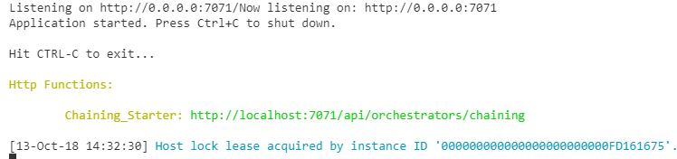
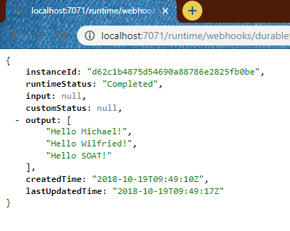

# Chaining Sample

## Créer les différentes fonctions nécessaires

Fonctions nécessaires: 
- Starter -> **Chaining_Starter**
- Orchestrator -> **Chaining_Orchestrator**
- Activity -> **Chaining_Activity**

Utiliser les commandes suivantes : 

```bash
func new --name Chaining_Starter --template "Durable Functions HTTP starter" --csx
func new --name Chaining_Orchestrator --template "Durable Functions orchestrator" --csx
func new --name Chaining_Activity --template "Durable Functions activity" --csx
```

## Mise à jour de notre fonction Chaining_Starter

On va mettre à jour notre code (**run.csx**), afin de spécifier le nom de notre orchestrateur, et supprimé les paramètres que nous avons besoin, nous aurons donc un code comme ci-dessous : 

```csharp
#r "Microsoft.Azure.WebJobs.Extensions.DurableTask"
#r "Newtonsoft.Json"

using System.Net;

private const string ORCHESTRATOR_FUNCTION_NAME = "Chaining_Orchestrator";
public static async Task<HttpResponseMessage> Run(
    HttpRequestMessage req,
    DurableOrchestrationClient starter,
    ILogger log)
{
    string instanceId = await starter.StartNewAsync(ORCHESTRATOR_FUNCTION_NAME, null);

    log.LogInformation($"Started orchestration with ID = '{instanceId}'.");

    return starter.CreateCheckStatusResponse(req, instanceId);
}
```

Comme nous avons changé la définition de notre function, en enlevant un paramètre, nous allons maintenant dans le fichier **function.json** afin de modifier la route pour la remplacer par **orchestrators/chaining**


## Mise à jour de notre fonction Chaining_Orchestrator

Cette fonction a pour rôle d'orchestrer nos différentes activités, il faut donc qu'elle connaisse le nom de notre activité, nous allons donc modifier le code de la sorte

```csharp
#r "Microsoft.Azure.WebJobs.Extensions.DurableTask"

private const string HELLO_ACTIVITY_FUNCTION_NAME = "Chaining_Activity";
public static async Task<List<string>> Run(DurableOrchestrationContext context)
{
    var outputs = new List<string>();

    // Replace "hello" with the name of your Durable Activity Function.
    outputs.Add(await context.CallActivityAsync<string>(HELLO_ACTIVITY_FUNCTION_NAME, "Michael"));
    outputs.Add(await context.CallActivityAsync<string>(HELLO_ACTIVITY_FUNCTION_NAME, "Wilfried"));
    outputs.Add(await context.CallActivityAsync<string>(HELLO_ACTIVITY_FUNCTION_NAME, "SOAT"));

    return outputs;
}
```

## Lancer votre application

Exécutez la commande suivante : 

```bash
func host start
```

_En cas d'erreur, référez vous à la doc [01-CoreTools.md](../01-CoreTools.md) qui vous aidera à configurer votre environnement._

Vous devriez avoir un résultat similaire à celui-ci : 


Rendez-vous sur l'url indiqué par les tools, vous devriez avoir le résultat suivant : 


Vous pouvez voir l'état de votre job en allant sur la requête de Status: 
