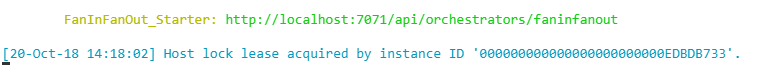
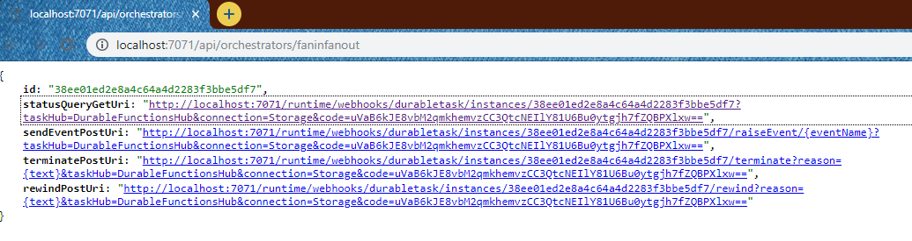
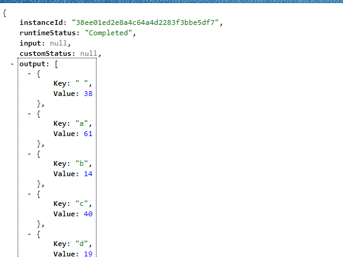

# Fan In Fan Out Sample

## Créer les différentes fonctions nécessaires

Fonctions nécessaires: 
- Starter -> **FanInFanOut_Starter**
- Orchestrator -> **FanInFanOut_Orchestrator**
- Activity -> **FanInFanOut_GetData**, **FanInFanOut_ProcessData**

Utiliser les commandes suivantes : 

```bash
func new --name FanInFanOut_Starter --template "Durable Functions HTTP starter" --csx
func new --name FanInFanOut_Orchestrator --template "Durable Functions orchestrator" --csx
func new --name FanInFanOut_GetData --template "Durable Functions activity" --csx
func new --name FanInFanOut_ProcessData --template "Durable Functions activity" --csx
```

## Mise à jour de notre fonction FanInFanOut_Starter

On va mettre à jour notre code (**run.csx**), afin de spécifier le nom de notre orchestrateur, et supprimé les paramètres que nous avons besoin, nous aurons donc un code comme ci-dessous : 

```csharp
#r "Microsoft.Azure.WebJobs.Extensions.DurableTask"
#r "Newtonsoft.Json"

using System.Net;

private const string ORCHESTRATOR_FUNCTION_NAME = "FanInFanOut_Orchestrator";
public static async Task<HttpResponseMessage> Run(
    HttpRequestMessage req,
    DurableOrchestrationClient starter,
    ILogger log)
{
    string instanceId = await starter.StartNewAsync(ORCHESTRATOR_FUNCTION_NAME, null);

    log.LogInformation($"Started orchestration with ID = '{instanceId}'.");

    return starter.CreateCheckStatusResponse(req, instanceId);
}
```

Comme nous avons changé la définition de notre function, en enlevant un paramètre, nous allons maintenant dans le fichier **function.json** afin de modifier la route pour la remplacer par **orchestrators/faninfanout**

## Mise à jour de notre fonction FanInFanOut_Orchestrator

Cette fonction a pour rôle d'orchestrer nos différentes activités. 
Ici nous allons donc appeler : 
- 1 activité ayant pour rôle de récupérer nos données
- 1 activité permettant de traiter chaque ligne de notre fichier

```csharp
#r "Microsoft.Azure.WebJobs.Extensions.DurableTask"

public static async Task<KeyValuePair<char, int>[]> Run(DurableOrchestrationContext context)
{
    string dataUrl = "https://raw.githubusercontent.com/SoatGroup/techlab-durablefunction/master/Lab_FanInFanOut/azureproducts.csv"; 
    var data = await context.CallActivityAsync<string[]>("FanInFanOut_GetData", dataUrl);

    var tasks = new Task<KeyValuePair<char, int>[]>[data.Length];

    for (int i = 0; i < data.Length; i++)
    {
        tasks[i] = context.CallActivityAsync<KeyValuePair<char, int>[]>("FanInFanOut_ProcessData", data[i]);
    }

    await Task.WhenAll(tasks);

    var keys = tasks.SelectMany(n => n.Result.Select(k => k.Key));
    var results = new SortedDictionary<char, int>();

    foreach (var key in keys.Distinct())
    {
        results.Add(key, tasks.SelectMany(n => n.Result).Where(n => n.Key == key).Sum(n => n.Value));
    }

    return results.ToArray();
}
```

## Mise à jour des activités

### FanInFanOut_GetData

Cette activité a pour rôle de récupérer nos données depuis notre source (ici un fichier CSV)

```csharp
#r "Microsoft.Azure.WebJobs.Extensions.DurableTask"
#r "System.Net.Http"

using System.Net.Http;

public static async Task<IEnumerable<string>> Run(string url)
{
    var client = new HttpClient();
    var response = await client.GetAsync(url);

    var lines = await response.Content.ReadAsStringAsync();
    var result = lines.Split(new[] { "\r\n" }, StringSplitOptions.RemoveEmptyEntries).ToList();
    return result;
}
```

Mettre à jour le fichier function.json pour changer le binding comme ci-dessous : 

```json
{
  "bindings": [
    {
      "name": "url",
      "type": "activityTrigger",
      "direction": "in"
    }
  ],
  "disabled": false
}
```

### FanInFanOut_ProcessData

Cette activité a pour rôle de compter les occurences de chaque lettre dans un mot. 

```csharp
#r "Microsoft.Azure.WebJobs.Extensions.DurableTask"

public static KeyValuePair<char, int>[] Run(string name)
{
    var characterCount = new SortedDictionary<char, int>();

    if (!string.IsNullOrWhiteSpace(name))
    {
        foreach (var character in name.ToLowerInvariant())
        {
            if (!characterCount.ContainsKey(character))
            {
                characterCount.Add(character, 1);
            }
            else
            {
                characterCount[character]++;
            }
        }
    }

    return characterCount.ToArray();
}
```

## Lancer votre application

Exécutez la commande suivante : 

```bash
func host start
```

_En cas d'erreur, référez vous à la doc [01-CoreTools.md](../01-CoreTools.md) qui vous aidera à configurer votre environnement._

Vous devriez avoir un résultat similaire à celui-ci : 


Rendez-vous sur l'url indiqué par les tools, vous devriez avoir le résultat suivant : 


Vous pouvez voir l'état de votre job en allant sur la requête de Status: 
