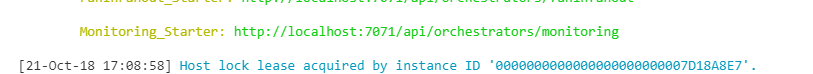
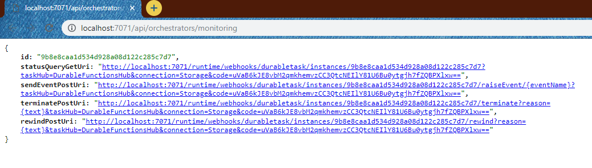
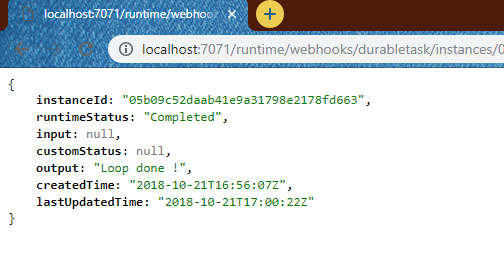

# Monitoring Sample

## Créer les différentes fonctions nécessaires

Fonctions nécessaires: 
- Starter -> **Monitoring_Starter**
- Orchestrator -> **Monitoring_Orchestrator**
- Activity -> **Monitoring_CheckRequest**

Utiliser les commandes suivantes : 

```bash
func new --name Monitoring_Starter --template "Durable Functions HTTP starter" --csx
func new --name Monitoring_Orchestrator --template "Durable Functions orchestrator" --csx
func new --name Monitoring_CheckRequest --template "Durable Functions activity" --csx
```

## Mise à jour de notre fonction Monitoring_Starter

On va mettre à jour notre code (**run.csx**), afin de spécifier le nom de notre orchestrateur, et supprimé les paramètres que nous avons besoin, nous aurons donc un code comme ci-dessous : 

```csharp
#r "Microsoft.Azure.WebJobs.Extensions.DurableTask"
#r "Newtonsoft.Json"

using System.Net;

private const string ORCHESTRATOR_FUNCTION_NAME = "Monitoring_Orchestrator";
public static async Task<HttpResponseMessage> Run(
    HttpRequestMessage req,
    DurableOrchestrationClient starter,
    ILogger log)
{
    string instanceId = await starter.StartNewAsync(ORCHESTRATOR_FUNCTION_NAME, null);

    log.LogInformation($"Started orchestration with ID = '{instanceId}'.");

    return starter.CreateCheckStatusResponse(req, instanceId);
}
```

Comme nous avons changé la définition de notre function, en enlevant un paramètre, nous allons maintenant dans le fichier **function.json** afin de modifier la route pour la remplacer par **orchestrators/monitoring**

## Mise à jour de notre fonction Monitoring_Orchestrator

Cette fonction a pour rôle d'orchestrer nos différentes activités. 
Ici nous allons donc appeler : 
- 1 activité ayant pour rôle de monitorer le statut d'un serveur. Ici on le simulera un temps long en regardant si le nombre de minute correspond à 0, 10, 20, 30, 40 ou 50 minutes

```csharp
/*
 * Before running this sample, please create a Durable Activity function (default name is "Hello")
 */

#r "Microsoft.Azure.WebJobs.Extensions.DurableTask"
#r "Microsoft.Extensions.Logging"

using System.Threading;

public static async Task<string> Run(DurableOrchestrationContext context, ILogger log)
{
    string url = "http://worldclockapi.com/api/json/utc/now"; 

    DateTime endTime = context.CurrentUtcDateTime.AddHours(1);

    while(context.CurrentUtcDateTime < endTime)
    {
        bool isDone = await context.CallActivityAsync<bool>("Monitoring_CheckRequest", url);

        if (isDone)
        {
            return "Loop done !";
        }
        else
        {
            // Wait for the next checkpoint
            var nextCheckpoint = context.CurrentUtcDateTime.AddMinutes(1);

            log.LogInformation($"Next check at {nextCheckpoint}.");

            await context.CreateTimer(nextCheckpoint, CancellationToken.None);
        }
    }

    return "Loop expired";
}
```

## Mise à jour de l'activité

### FanInFanOut_GetData

Cette activité a pour rôle de monitorer le statut d'un serveur. Ici on le simulera un temps long en regardant si le nombre de minute correspond à 0, 10, 20, 30, 40 ou 50 minutes

```csharp
#r "Microsoft.Azure.WebJobs.Extensions.DurableTask"
#r "System.Net.Http"
#r "Newtonsoft.Json"

using System.Net.Http;
using Newtonsoft.Json.Linq;

public async static Task<bool> Run(string url)
{
	var client = new HttpClient();
	
	var result = await client.GetAsync(url);
	if (result.IsSuccessStatusCode)
	{
		var content = await result.Content.ReadAsStringAsync();
        var obj = JObject.Parse(content); 
        var serverDateTime = DateTime.Parse(obj["currentDateTime"].ToString());
        
        return (serverDateTime.Minute % 10) == 0;
	}
    return false;
}
```

Mettre à jour le fichier function.json pour changer le binding comme ci-dessous : 

```json
{
  "bindings": [
    {
      "name": "url",
      "type": "activityTrigger",
      "direction": "in"
    }
  ],
  "disabled": false
}
```


## Lancer votre application

Exécutez la commande suivante : 

```bash
func host start
```

_En cas d'erreur, référez vous à la doc [01-CoreTools.md](../01-CoreTools.md) qui vous aidera à configurer votre environnement._

Vous devriez avoir un résultat similaire à celui-ci : 


Rendez-vous sur l'url indiqué par les tools, vous devriez avoir le résultat suivant : 


Vous pouvez voir l'état de votre job en allant sur la requête de Status: 
